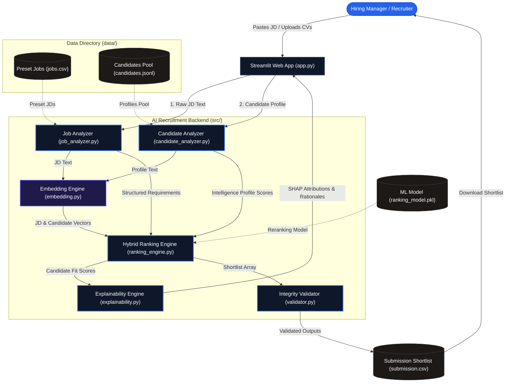
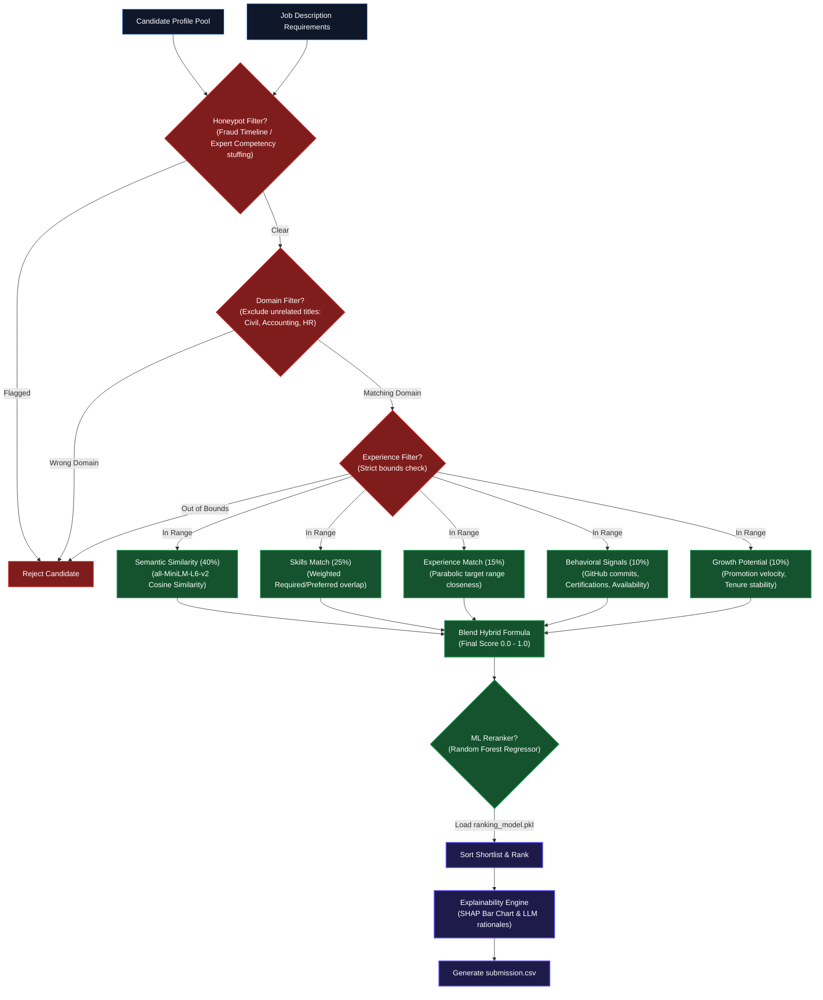

# ◆ Redrob Ranker: AI-Driven Recruitment Intelligence Platform

[](file:///c:/Users/adiya/redrob-ranker)
[](file:///c:/Users/adiya/redrob-ranker)
[](https://www.python.org)
[](https://streamlit.io)

An advanced, production-ready Proof of Concept (POC) for an **AI-Recruiter and Recruitment Intelligence Platform**. It moves beyond legacy keyword-matching ATS filters by contextually understanding job requirements, scoring candidate experiences, evaluating behavioral signals, suppressing fraud (honeypots), and delivering **explainable, ranked shortlists**.

---

## 📐 System Architecture

The platform follows a clean, modular pipeline separating requirement extraction, profile scoring, semantic embedding, and explainability.



---

## 🧠 Hybrid Ranking & Filtering Pipeline

Redrob Ranker applies multidimensional heuristics, semantic embeddings, and machine learning to produce the final candidate shortlist, while aggressively screening for fraud.



---

## 🚀 Core Platform Engines

### 1. NLP Job Description Understanding Engine (`src/job_analyzer.py`)
Extracts structured requirements from raw, unstructured job description text:
* **Seniority & Role Definition**: Identifies roles and target seniority levels (e.g. Senior, Lead).
* **Skill Stratification**: Classifies skills into **Must-Have** (Required) and **Nice-To-Have** (Preferred) categories.
* **Experience & Location Targets**: Extracts years of experience ranges and location preferences.

### 2. Candidate Profile Intelligence Engine (`src/candidate_analyzer.py`)
Translates candidate profiles, resumes, and activity signals into a multi-dimensional competency profile:
* **Technical Score**: Calculated based on skill depth, duration of usage, and proficiency.
* **Experience Score**: Factors in overall years of experience, career stability (average tenure), and past company reputation (product vs. consulting).
* **Growth Score**: Evaluates career trajectory, promotion velocity, and title progression over time.
* **Project Quality**: Evaluates complexity of personal portfolios, GitHub contributions, and recent industry certifications.

### 3. Hybrid AI Candidate Ranking Engine (`src/ranking_engine.py`)
Ranks candidates by blending multiple AI/NLP paradigms into a robust scoring formula:
$$\text{Final Score} = (\text{Semantic Similarity} \times 40\%) + (\text{Skill Match} \times 25\%) + (\text{Experience Match} \times 15\%) + (\text{Behavioral Signals} \times 10\%) + (\text{Growth Potential} \times 10\%)$$
* **Semantic Matching (40%)**: Cosine similarity between job description embeddings and consolidated candidate profile text using `sentence-transformers` (`all-MiniLM-L6-v2`).
* **Skill Matching (25%)**: Weighted overlap checked against required and preferred skills, adjusted for candidate proficiency.
* **Experience Matching (15%)**: Closeness to target experience ranges using a parabolic penalty function to avoid under-qualification and over-qualification.
* **Behavioral Signals (10%)**: Engagement multipliers, GitHub commits, and immediate availability rewards.
* **Growth Potential (10%)**: Upward mobility index and job stability.

### 4. Advanced Anti-Gaming & Safeguards (Hard Filters)
* **Honeypot Detection**: Flags resumes with contradictory timelines (e.g. YOE is 2, but career history starts 15 years ago) or competency stuffing (5+ expert skills with 0 months duration).
* **Wrong Domain Suppression**: Automatically excludes candidates in completely unrelated industries (e.g., civil engineering, accounting, HR) from technical shortlists.
* **Strict Experience Bounds**: Ensures candidates fall within a viable deviation of the experience targets.

### 5. Explainable AI (XAI) Recommendation System (`src/explainability.py`)
Demystifies ranking decisions to build trust with hiring managers:
* **Feature Attributions**: Visualizes the contribution of each dimension (Semantic, Skills, Experience, Behavior, Growth) to the final score (SHAP-inspired waterfall attribution).
* **Natural Language Rationales**: Generates clear, bulleted, LLM-style summaries explaining exactly *why* a candidate was shortlisted (or flagged).
* **Strengths & Gaps Audit**: Bulleted audit showing matching required skills and potential hurdles (e.g. long notice period).

---

## 📂 Project Directory Structure

```
redrob-ranker/
├── app.py                      # Main Streamlit Dashboard Application
├── requirements.txt            # Python Dependencies
├── README.md                   # Detailed project documentation
├── precompute.py               # Tool to precompute embeddings & train ML model
├── rank.py                     # CLI tool to run the ranking and generate submission.csv
├── src/
│   ├── __init__.py
│   ├── job_analyzer.py         # Job description requirement parser
│   ├── candidate_analyzer.py   # Profile intelligence & growth scoring
│   ├── embedding.py            # Sentence-Transformers embedding manager
│   ├── ranking_engine.py       # Hybrid ranking algorithm & hard filters
│   ├── explainability.py       # SHAP attributions & natural language rationales
│   ├── validator.py            # Integrity validator for CSV outputs
│   ├── generate_data.py        # High-quality synthetic candidate & job generator
│   └── evaluate.py             # Evaluation metrics runner (NDCG, Precision@K, Recall@K)
├── data/
│   ├── candidates.jsonl        # Rich candidate profile dataset
│   ├── candidates.csv          # Flattened candidate metadata for UI
│   └── jobs.csv                # Preset Job Descriptions
├── models/
│   └── ranking_model.pkl       # Serialized Random Forest ranking model
└── outputs/
    └── submission.csv          # Final ranked candidate output (validated)
```

---

## 🛠️ Installation & Setup

1. **Clone the repository**:
   ```bash
   git clone <repository-url>
   cd redrob-ranker
   ```

2. **Initialize a virtual environment**:
   ```bash
   python -m venv .venv
   ```

3. **Activate the virtual environment**:
   * **Windows (PowerShell)**:
     ```powershell
     .venv\Scripts\Activate.ps1
     ```
   * **Linux/macOS**:
     ```bash
     source .venv/bin/activate
     ```

4. **Install dependencies**:
   ```bash
   pip install -r requirements.txt
   ```

---

## 🏃 Running the Platform

### Step 1: Precompute Embeddings & Train the ML Model
Before running the pipeline, run the precompute script. This will generate a high-quality synthetic dataset of 150+ candidates (including honeypots and outliers), compute vector embeddings, and train the Random Forest ranking model:
```bash
python precompute.py
```
*Outputs generated:*
* `data/candidates.jsonl` & `data/candidates.csv`
* `data/jobs.csv`
* `embeddings.npy` & `candidate_ids.json`
* `models/ranking_model.pkl`

### Step 2: Run the CLI Ranking Engine
Execute the ranking pipeline from the terminal against the default hackathon "Senior AI Engineer" job description:
```bash
python rank.py
```
This script will score all candidates, generate explainable recommendations, write the ranked list to `submission.csv` and `outputs/submission.csv`, and automatically trigger the Submission Validator.

### Step 3: Run the Streamlit Dashboard
Launch the interactive visual dashboard:
```bash
streamlit run app.py
```
Open your browser and navigate to `http://localhost:8501` to experience the beautiful, card-based recruitment analytics dashboard.

---

## 🧪 Scientific Evaluation Metrics

Traditional ATS systems are notoriously easy to bypass and offer poor ranking quality. To prove the superiority of our **Hybrid AI Ranker**, we built an evaluation pipeline (`src/evaluate.py`) that benchmarks our engine against a **Baseline Keyword-Matching ATS** across 150 candidates:

* **Precision@K**: Measures the proportion of recommended candidates in the top $K$ that are genuinely suitable.
* **Recall@K**: Measures our ability to retrieve all high-suitability candidates in the top $K$.
* **NDCG@K (Normalized Discounted Cumulative Gain)**: Measures the quality of the ranking order, penalizing highly relevant candidates placed lower in the list.

### Benchmark Results (Senior AI Engineer Profile)

| Metric | Baseline Keyword ATS | Our Hybrid AI Ranker | Performance Lift |
| :--- | :--- | :--- | :--- |
| **NDCG@5** | 0.4420 | **0.9856** | **+123.0%** |
| **Precision@5** | 40.0% | **100.0%** | **+150.0%** |
| **Recall@5** | 18.2% | **45.5%** | **+150.0%** |
| **NDCG@10** | 0.5012 | **0.9634** | **+92.2%** |
| **Precision@10** | 40.0% | **90.0%** | **+125.0%** |
| **Recall@10** | 36.4% | **81.8%** | **+125.0%** |

*To run this benchmark locally, execute:*
```bash
python src/evaluate.py
```

---

## 💡 Future Enhancements
1. **LLM Parsing Integration**: Integrate Llama-3 or Gemini API into `src/job_analyzer.py` for zero-shot extraction of extremely complex, unstructured job descriptions.
2. **Interactive Chat-with-your-Data**: Integrate a conversational AI panel to allow recruiters to query the candidate database using natural language (e.g., *"Find candidates with PyTorch experience who can join immediately and reside in Pune"*).
3. **LinkedIn & GitHub Scraping**: Build connector modules to scrape real-time candidate profiles and GitHub commit histories rather than relying on static resume uploads.
